# ResQTech

<div align="center">
  <p align="center">
    <strong>An Offline-First Disaster Preparedness, Emergency Response, and Community Safety Platform</strong>
    <br />
    Built for Android with Kotlin, Jetpack Compose, Hilt, Room, and Firebase AI Logic.
  </p>
</div>

---

## Overview

**ResQTech** is a comprehensive Android application designed to enhance personal safety and community coordination during natural disasters and emergency situations. In critical scenarios where internet connectivity can be unreliable or overloaded, ResQTech adopts an **offline-first** architecture—pairing local Room database caching and emergency toolkits with cloud-powered AI assistance and crowdsourced incident reporting.

---

## Key Features

### 1. AI Assistant (Powered by Firebase AI Logic)
- **Generative AI Model**: Utilizes Google's **`gemini-3.8-flash`** model via Firebase AI Logic (`firebase-ai`) for real-time, context-aware disaster guidance and first-aid recommendations.
- **Resilient Retry Mechanism**: Automatically detects transient cloud failures (such as HTTP 503, high demand, overloaded, or timeouts) and retries up to 3 times with bounded exponential backoff (immediate, 1s, 2s).
- **Offline Room FAQ Fallback**: If online network calls or API retries fail, the assistant seamlessly falls back to a local SQLite database (`AppDao.findAnswer`) to provide immediate offline emergency instructions.
- **App Check Security**: Enforces Firebase App Check (with Debug Provider integration for development/testing) to secure AI proxy requests.

### 2. Emergency & SOS Functionality
- **Instant SOS Alerts**: Quickly broadcast emergency distress signals with precise GPS coordinates (via Play Services Location) to pre-registered emergency contacts.
- **Loud Alarm**: Built-in high-decibel audible alarm sound player for signaling distress or alerting nearby rescuers.
- **Nearest Hospital Locator**: Discover and navigate to nearby medical facilities during emergencies.
- **Emergency Contact Management**: Add, view, and manage trusted emergency contacts locally and in Room storage.

### 3. Crowdsourced Community Reports
- **Incident Reporting**: Submit geolocated hazard reports categorized by severity and type (Road Blockage, Power Outage, Flooding, Medical Emergency, Fire Hazard, Infrastructure Damage, Shelter Needed).
- **Photo Evidence**: Capture photos directly via device camera (leveraging `FileProvider` secure content URIs) or pick from the gallery, with automatic client-side bitmap compression and Firebase Storage upload (`reports_photos`).
- **Confirmation Voting**: Community members can confirm or upvote reports to help verify safety conditions in real-time.
- **Report Management**: Owners can review and delete their submitted reports securely.

### 4. Preparedness Hub & Evacuation Guidance
- **Disaster Guides & Checklists**: Actionable guides, dos and don'ts, and emergency kit packing lists.
- **Evacuation Mapping**: Interactive Google Maps views (`maps-compose`) displaying live alerts, safe zones, and evacuation routes.

### 5. Authentication & Settings
- **Firebase Authentication**: Email/password sign-in and user profile synchronization with Firestore.
- **DataStore Preferences**: Local preference management for user settings.

---

## Technical Architecture

ResQTech follows modern **MVVM (Model-View-ViewModel)** architecture combined with clean unidirectional data flow in Jetpack Compose:

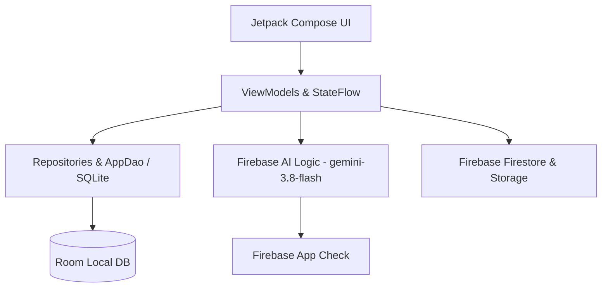

- **UI Layer**: Jetpack Compose and Material 3, driven by lifecycle-aware `StateFlow` and Compose state.
- **Dependency Injection**: Google **Hilt** for robust modular dependency management across ViewModels, DAOs, and repositories.
- **Local Data**: **Room Database** for offline persistence of emergency contacts, user profiles, and FAQ search items.
- **Cloud Services**: **Firebase** (Auth, Firestore, Storage, AI Logic, App Check).
- **Asynchronous Processing**: **Kotlin Coroutines & Flow** for thread-safe operations off the main thread (`Dispatchers.IO`).

---

## Tech Stack

| Layer / Component | Technology / Library | Version |
|---|---|---|
| **Language** | Kotlin | 2.3.x |
| **UI Framework** | Jetpack Compose & Material 3 | Compose BOM 2024.02.02 |
| **Dependency Injection** | Hilt | 2.51.1 |
| **Local Database & ORM** | Room | 2.8.5 |
| **Compiler & Annotation Processing** | KSP (Kotlin Symbol Processing) | 2.3.12 |
| **Cloud & Backend** | Firebase BoM | 34.19.0 |
| **Generative AI** | Firebase AI Logic (`firebase-ai`) | BoM-managed (`gemini-3.8-flash`) |
| **Security** | Firebase App Check Debug | BoM-managed (`firebase-appcheck-debug`) |
| **Authentication & Database** | Firebase Auth & Firestore | BoM-managed |
| **Storage** | Firebase Storage | BoM-managed |
| **Asynchronous & State** | Kotlin Coroutines & Flow | 1.7.3 |
| **Maps & Location** | Google Maps Compose & Play Services Location | Maps 4.3.3 / Location 21.2.0 |
| **Image Loading** | Coil Compose | 2.5.0 |
| **Local Preferences** | DataStore Preferences | 1.0.0 |
| **Networking** | Retrofit & OkHttp | Retrofit 2.9.0 / OkHttp 4.12.0 |

---

## Project Structure

```text
com.example.team_gamma/
├── auth/                 # Authentication ViewModels and state management
├── component/            # Reusable UI components (e.g., SOS confirmation dialogs)
├── data/                 # Room Database, DAOs, Entities, Repositories, ViewModels
│   ├── AiAssistantViewModel.kt   # Gemini AI Logic with retry & fallback
│   ├── LocalReportsViewModel.kt  # Community reports & photo compression/upload
│   └── AppDatabase.kt            # Room SQLite database configuration
├── loginscreen/          # Login and Sign Up Compose screens
├── onboarding/           # Welcome flow and emergency contact setup
├── screens/              # Main feature screens (AI Assistant, Reports, Maps, Hub, SOS)
│   ├── AiAssistantScreen.kt
│   ├── CreateReportScreen.kt
│   ├── LocalReportsScreen.kt
│   └── GoogleMapScreen.kt
├── ui/theme/             # Material 3 Color scheme, Typography, and Theme
├── MainActivity.kt       # Single-activity host with NavHost navigation
└── TeamGammaApplication.kt # Application class with Hilt entry point & App Check setup
```

---

## App Screenshots

Explore the key screens and user flows of ResQTech below:

### 1. Login
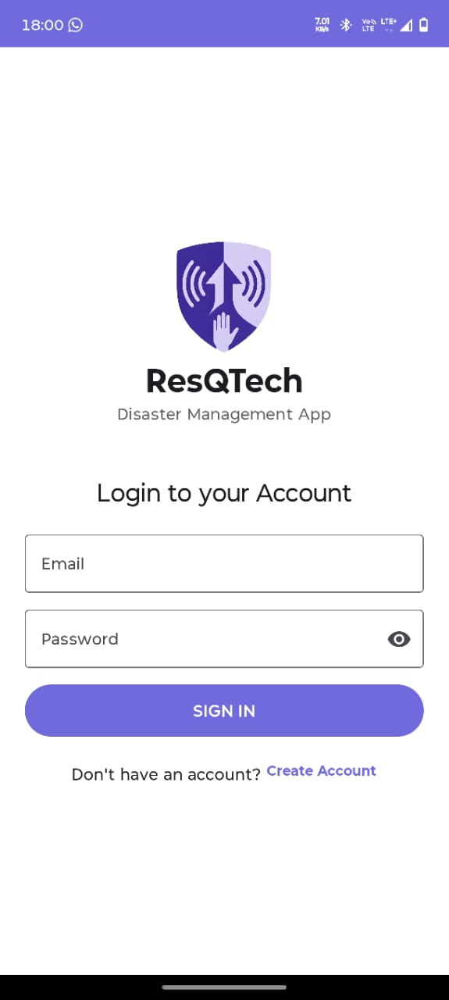

### 2. Create Account
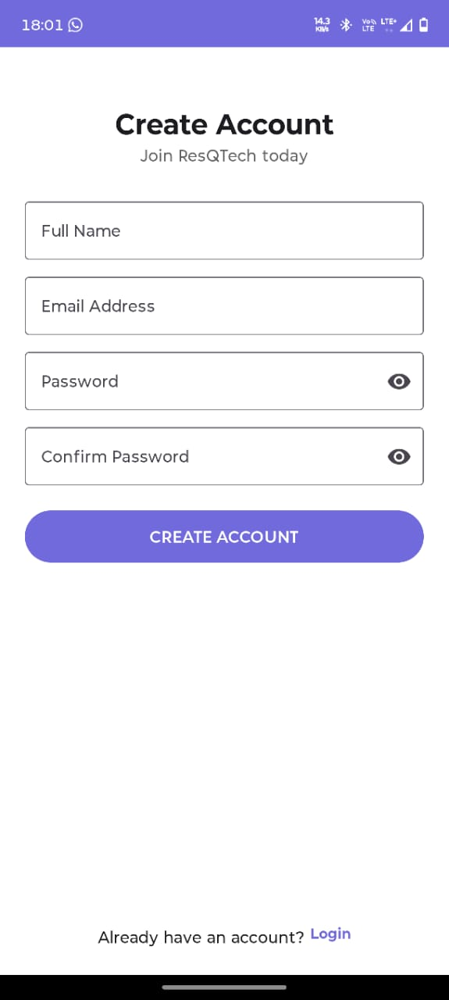

### 3. Home
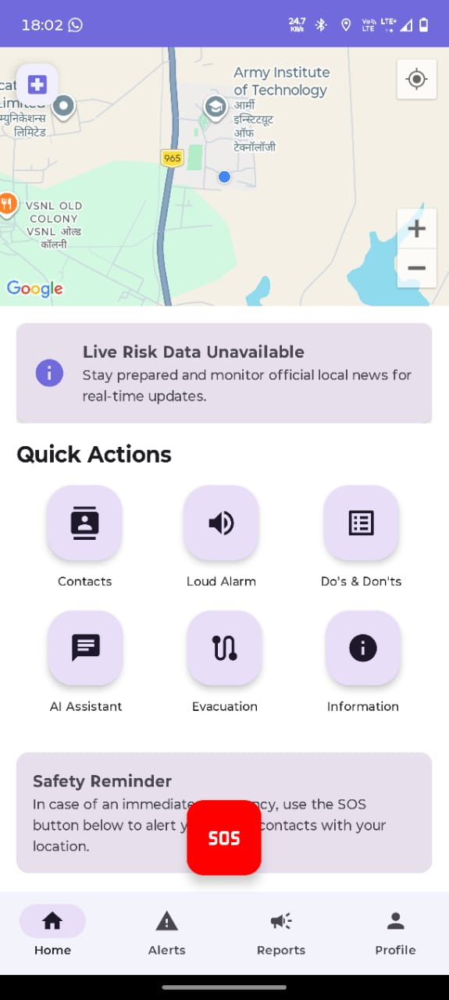

### 4. Alerts
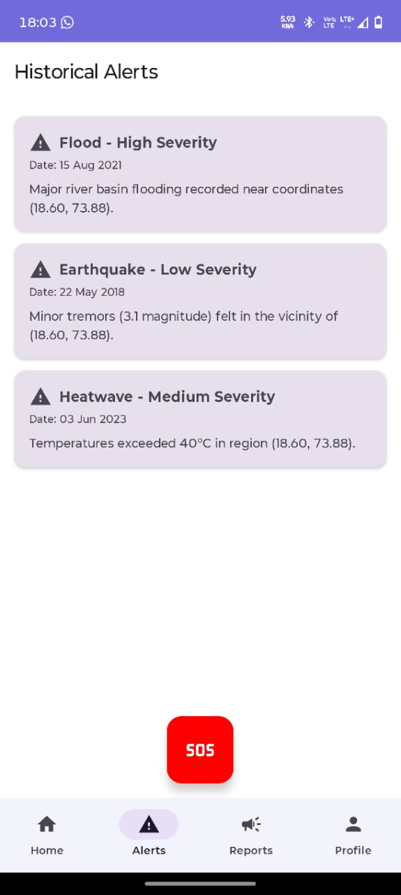

### 5. Emergency Contact / SOS
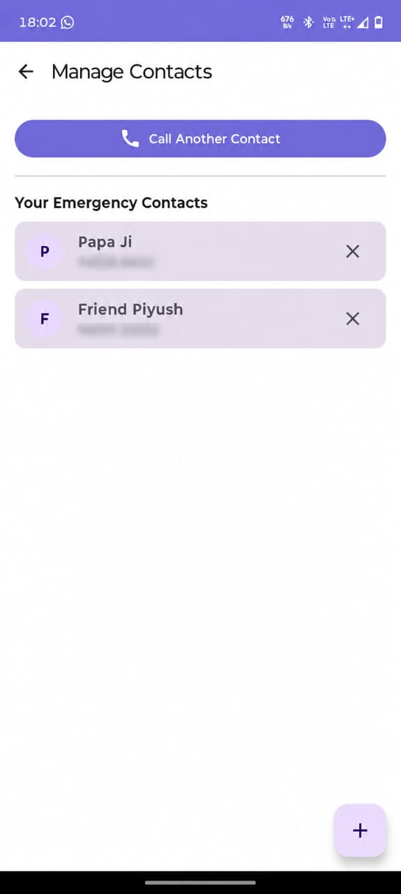

### 6. Evacuation
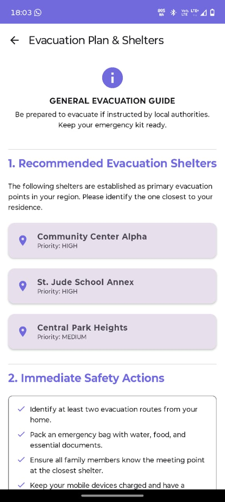

### 7. Community Reports
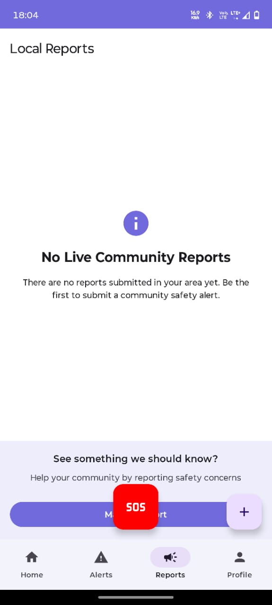

### 8. Report Details
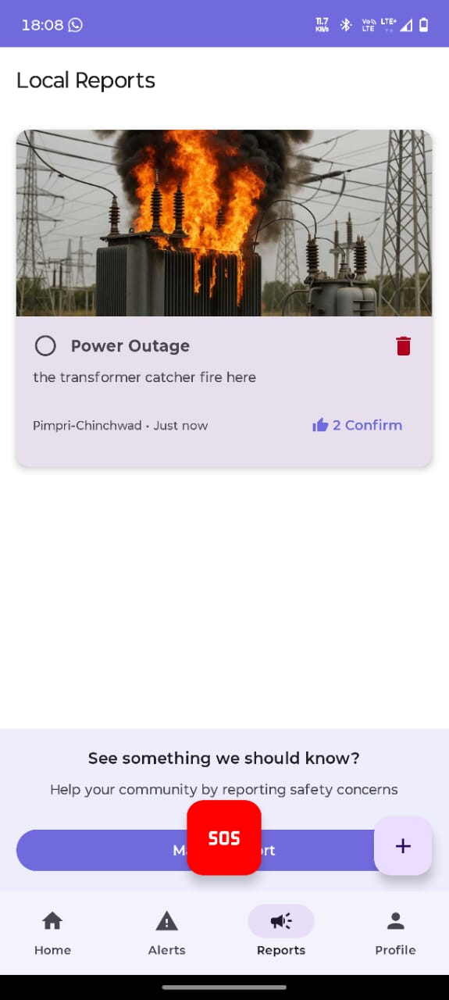

### 9. Info / Dos & Don'ts
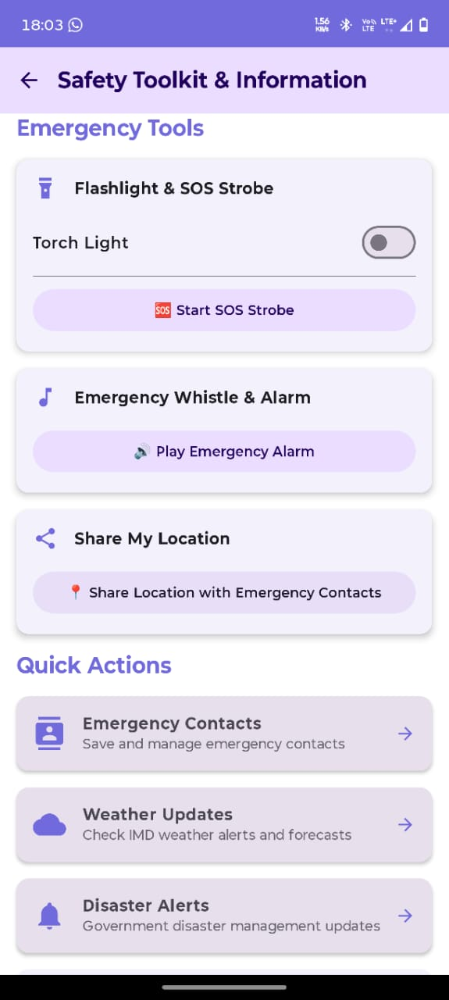

### 10. Profile
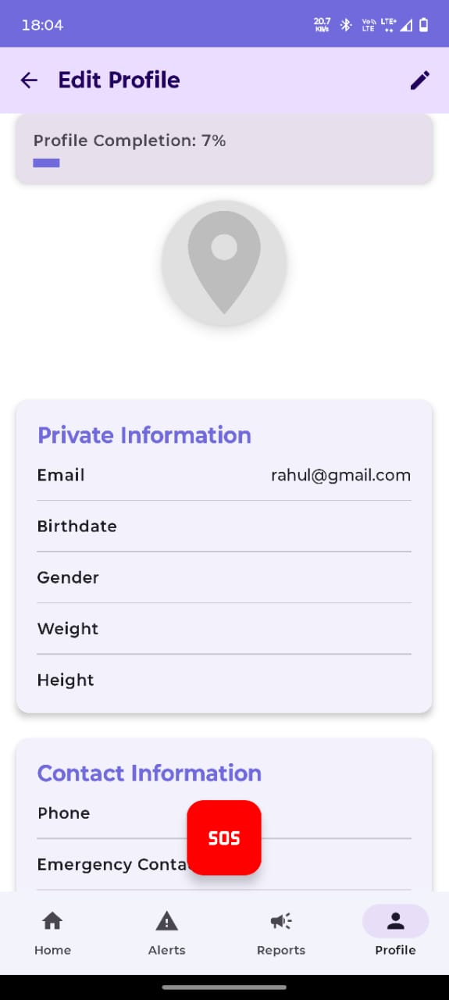

### 11. AI Assistant
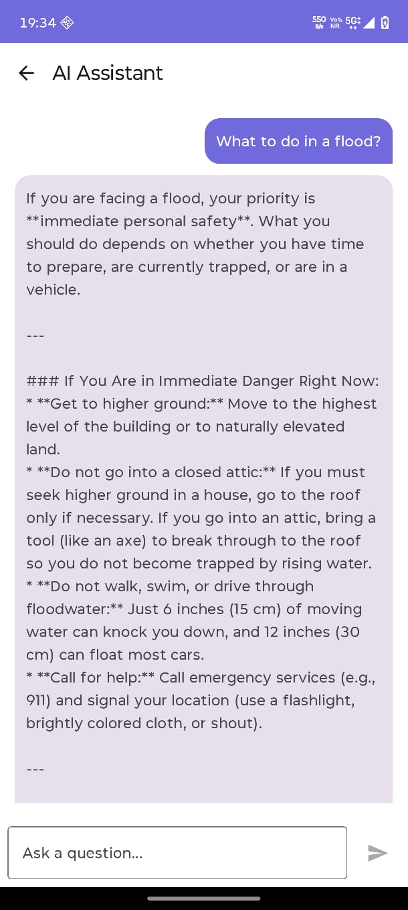

---

## Setup & Installation

### Prerequisites
- **Android Studio**: Iguana / Jellyfish or newer.
- **JDK**: JDK 17 or higher.
- **Android SDK**: Compile SDK 34, Min SDK 24, Target SDK 34.

### Step-by-Step Guide
1. **Clone the Repository**:
   ```bash
   git clone https://github.com/Raj-arch-cmd/Team-Gamma.git
   cd Team-Gamma
   ```

2. **Configure Local Properties**:
   Create a `local.properties` file in the project root directory and add your Google Maps API key:
   ```properties
   MAPS_API_KEY=your_actual_google_maps_api_key_here
   ```
   *Note: The Gemini API key is securely managed through Firebase AI Logic and `google-services.json`; no direct Gemini API key needs to be hardcoded.*

3. **Firebase Configuration**:
   Ensure `google-services.json` is placed in the `app/` directory (already configured for the project Firebase project).

4. **Build and Run**:
   Open the project in Android Studio, allow Gradle to sync, and run the app on your connected physical Android device or emulator.

---

## Firebase Configuration & Security

- **Services Used**: Firebase Authentication, Cloud Firestore, Cloud Storage, Firebase AI Logic, and Firebase App Check.
- **Committed vs. Local Files**:
  - `google-services.json` contains public client identifiers and is safely committed.
  - `local.properties` contains private developer credentials (`MAPS_API_KEY`) and is excluded from version control via `.gitignore`.
- **App Check**: Enforced via Firebase AI Logic proxy gateway. During development, `DebugAppCheckProviderFactory` is installed in `TeamGammaApplication` for debug builds.

---

## Android Permissions

ResQTech requests the following permissions in `AndroidManifest.xml`:
- `INTERNET` & `ACCESS_NETWORK_STATE`: Required for online Firebase sync, cloud AI calls, and network availability checks.
- `ACCESS_FINE_LOCATION` & `ACCESS_COARSE_LOCATION`: Required for GPS coordinate retrieval during SOS alerts and map rendering.
- `CAMERA`: Required for capturing photo evidence for community reports.
- `READ_CONTACTS`: Required for importing emergency contacts.
- `SEND_SMS`: Required for dispatching emergency distress SMS messages.
- `POST_NOTIFICATIONS`: Required for foreground service and alert notifications.
- `VIBRATE`: Required for haptic feedback during SOS alerts and alarms.

---

## Build & Testing

Run the following Gradle wrapper commands in the project root:

- **Clean Build**:
  ```bash
  ./gradlew clean assembleDebug
  ```
- **Unit Tests**:
  ```bash
  ./gradlew testDebugUnitTest
  ```

---

## Limitations & Current Status

- **Network Dependency**: While the app features robust offline Room FAQ fallback and local emergency toolkits, real-time AI assistance and crowdsourced reports require an active internet connection.
- **App Check Debug Mode**: Debug builds use the App Check Debug Provider. Production releases must configure Play Integrity attestation in the Firebase Console before enforcement.

---

## Future Improvements

- Implementation of Firebase Cloud Messaging (FCM) for push notifications on official disaster warnings.
- Background location tracking for real-time evacuation tracking.
- Multi-language localization for regional disaster response.


